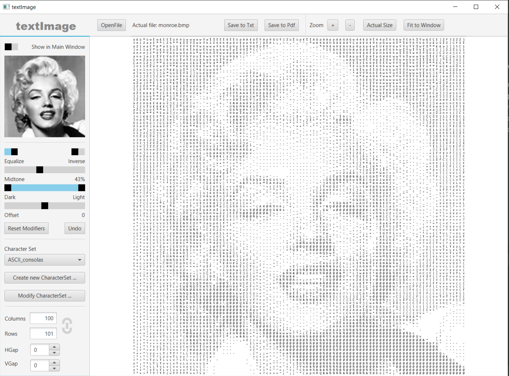
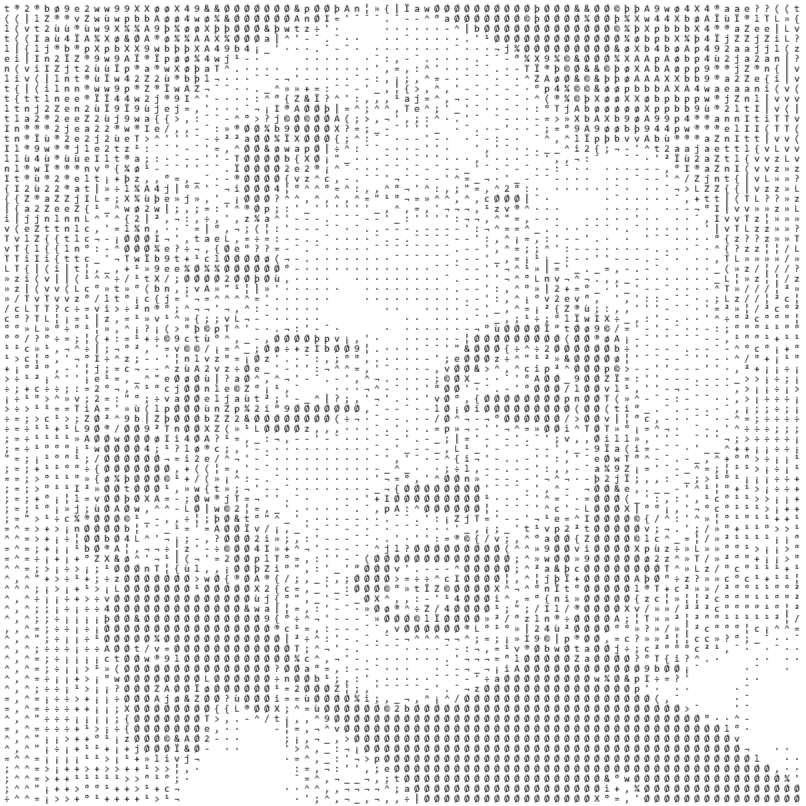
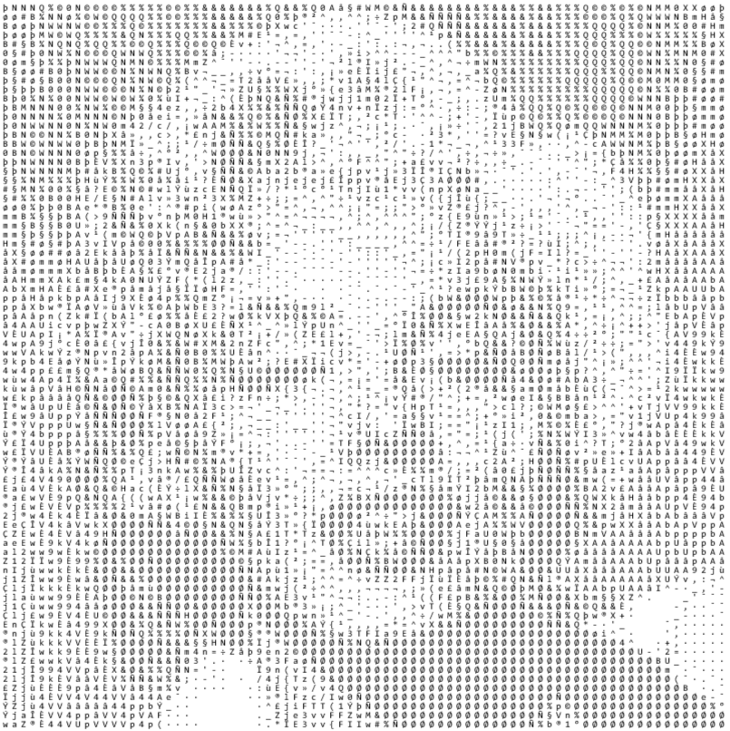
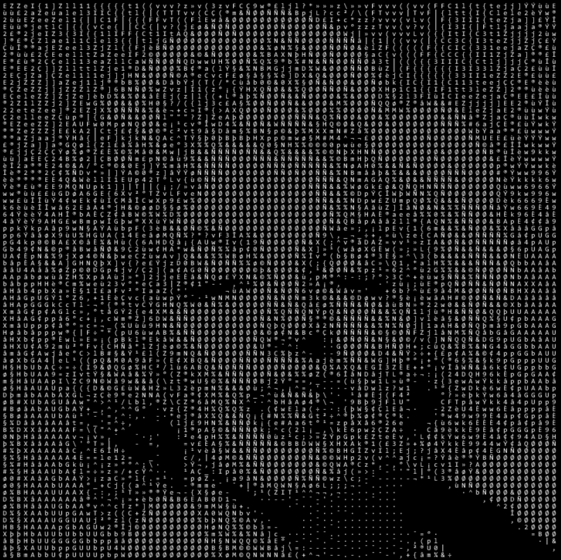
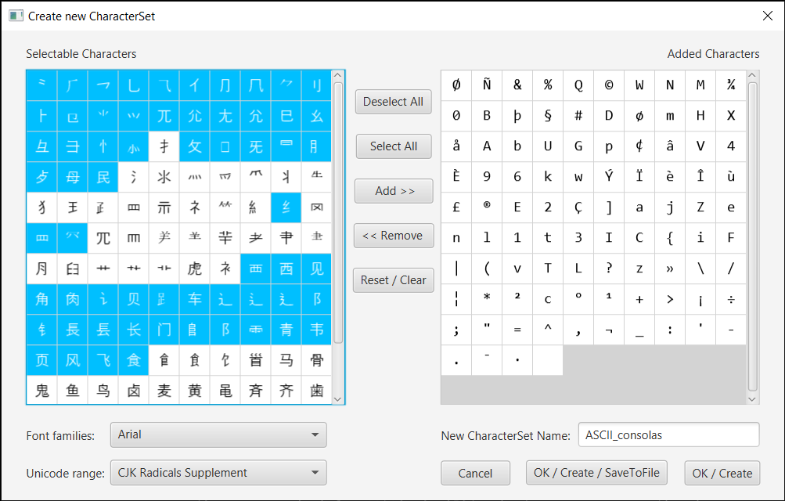
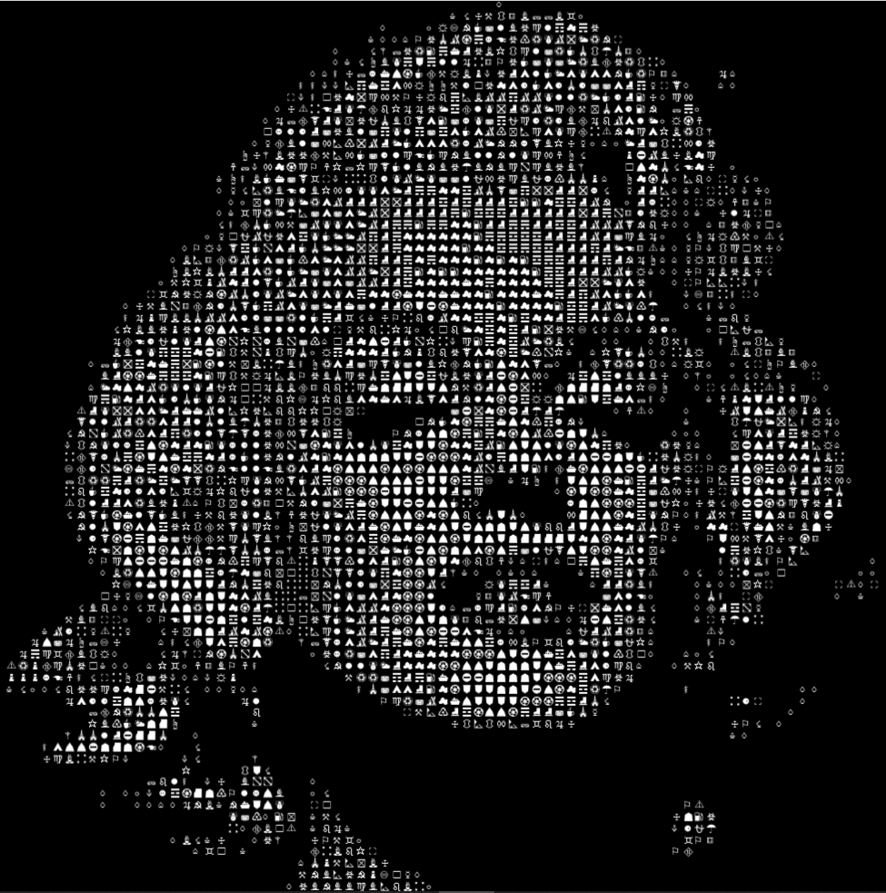
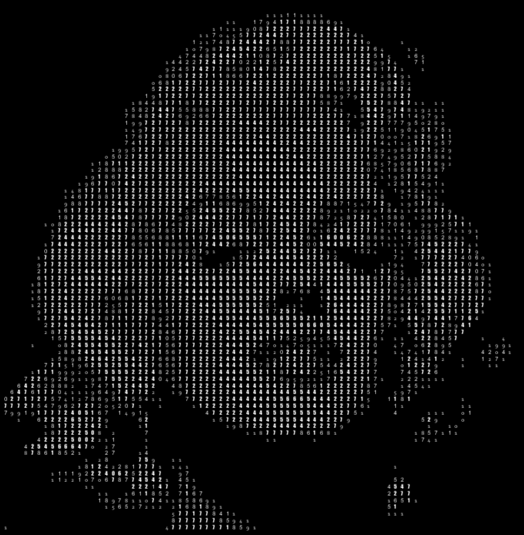

# TextImage-JavaFX
Convert your image to text - with JavaFX UI

## Technologies used
`Java 11` `JavaFX`

**Application screenshot**

## Image manipulation
You can manipulate the lightness/darkness of the pixels in your image in real time. You can change the brightness range of the pixels, the midtone (similar to gamma correction, based on an exponential function). You can ofset the brightness values. And you can equalize the distribution of brightness values.
You can also use a dark background.

  

## Character sets
You can use one of the predefined character sets. But you can also make one of the fonts installed on your computer!

**Character set selector screenshot**

